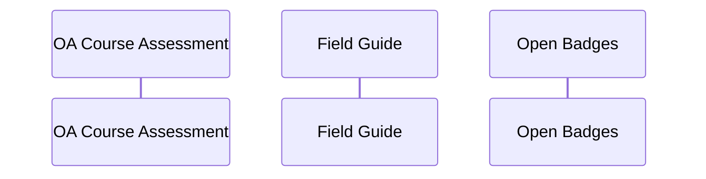

<!---
  What goes into a readme file

  1. Add your project title. Make sure it matches the above name ##
  2. Insert Vision Statement > 
  Below you can add a short bullet points rational for the project (2, 3 bullets max.)
  3. Add the names of the project lead. Use your GitHub username. If there are teammates, add these details 
  4. Offer some structure with a table 
  5. Conclude with credits and license
  
  --->

# Open-Umbrella
 

## What is the Open Umbrella(OA)?
The “open umbrella” is a professional learning project. It offere a framework to arange course OER. It offere 8 self-defined entry points for improving a courses. it acts as a mechanism to consolidate capacity for ICTE
The OA intends to offer a scaffolded portfolio of tools and choices, (a self evaluation tool, field guide and open badges) It is a safe and protected space where educators can build their unique & balanced course. 

## **The Pitch**

To enable academics, instructional designers and ed techies to find a safe space where they can bridge the many gaps that exists between their online and remote courses and their in person physical classes on the campus

* **Academics** - Do you want to to do more than with your course. Are you tired of waiting for someone else to update your course site?  
* **HOD**  - Do you have particular training needs in your department? Do you have a community of like minded information professionals who can mentor young students and create leadership pathways

   * Weblearning and the open umbrella can mentor and socialize the work with course development tools and build a on online course using the open umbrella , through a structured mentorship programme  

### Objectives: 

We would like to socialize collaborative tools among academics, instructional designers and ed techies . We wish to encourage the growth of a course development community who can act as maintainers of a course shell. We think that we can create a welcoming, diverse, and sustainable course development space, that compliments existing campus services.  

### 

### Problem

There is inadequate capabiliteies on among course production teams and co-ordination of all their skills and services. 

### The Proposal 
Weblearning proposes to run a structured mentorship programme using the open umbrella  

We propose that we running a 8-week cohorts in mentorship. 

The mentorship will include guided reflection and hands-on implementation of the open umbrellas concepts, processes, and

techniques. 

### The TEAM
The open umbrella community (OUC) is an inclusive ICTE comminity that focusses on sharing and promoting open education practices and reseources.
Here, colleagues and students (departmental or disciplinary) can collaborate with each other. And be recognized for contributions to making course open

# Components of the Open Umbrella
1 The Self Evaluation App, with eight stating points or elememts that is made Adobe storyline 

2 A field guide that corresponsds with the eight starting points 

3 The rudiments set of Open Badges, that meed to correspond with the app or the eight elelmemts. 

[cc-by]: http://creativecommons.org/licenses/by/4.0/
[cc-by-image]: https://i.creativecommons.org/l/by/4.0/88x31.png
[cc-by-shield]: https://img.shields.io/badge/License-CC%20BY%204.0-lightgrey.svg

|  🗃️     |              Lesson Link              |                       Concepts Taught                       |                     Learning Goal                 |                             
| :---: | :------------------------------------: | :---------------------------------------------------------: | ----------------------------------------------------------- |
| 01 | Onboard candidates to the Open Umbrella (OU), the self-assessment tool and badges |  | | 
| 02 | Annotate the eight practice areas on the OU using Hypothes.is |  | | 
| 03 | Github community and grow your own developer community |  | | 
| 04 | Community engagement and bring feedback  to a specific (OU) panel  |  | | 
| 05 | Code Syntheisis openly licensed community materials with comments and research |  | | 
| 06 | Share and showcase this work and (once reviewed) have it ready to add to the github OU   |  | | 
| 07 | Workflow  the collaboration workflow with github |  | | 
| 08 | Be invited to become an OU leader and mentor others in this journey |  | | 

