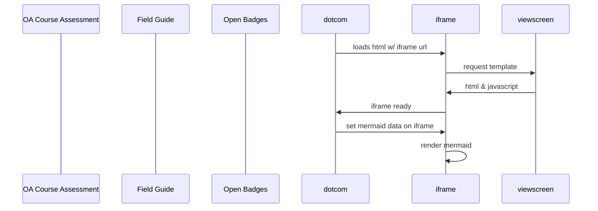

# Open-Umbrella
  [![CC BY 4.0][cc-by-shield]][cc-by]

The open umbrella community (OUC) is an inclusive ICTE comminity that focusses on sharing and promoting open education practices and reseources.

The OCC at present is unaffiliated, but would like to be a part of an larger organization, that is rooterd primariliy in Africa  

## Who can join the OUC in south 

What does the OUC do? 
Help each other out towards working more openly, collaborativly and FAIRly 

We create space 

Adapted from osc-delft.github.io

consists  of three componenets.

1 The Self Evaluation App, with eight stating points or elememts that is made Adobe storyline 

2 A field guide that corresponsds with the eight starting points 

3 The rudiments set of Open Badges, that meed to correspond with the app or the eight elelmemts. 

