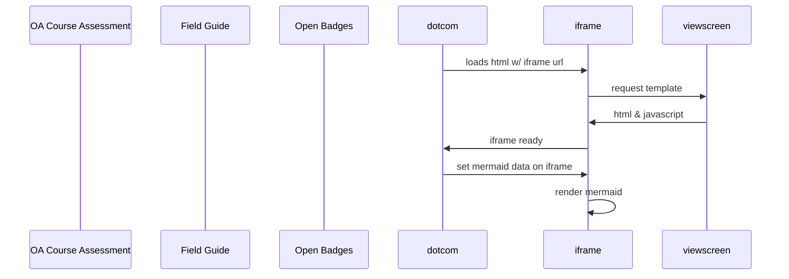

# Open-Umbrella
 

The open umbrella is intended to build up open and consolidate capacity for ICTE
This resource intends to offer a scaffolded portfolio of tools and choices, (a self evaluation tool, field guide and open badges) 
Where educators can build their unique & balanced course. 

The open umbrella community (OUC) is an inclusive ICTE comminity that focusses on sharing and promoting open education practices and reseources.
Here, colleagues and students (departmental or disciplinary) can collaborate with each other. And be recognized for contributions to making course open

# Components
1 The Self Evaluation App, with eight stating points or elememts that is made Adobe storyline 

2 A field guide that corresponsds with the eight starting points 

3 The rudiments set of Open Badges, that meed to correspond with the app or the eight elelmemts. 

[cc-by]: http://creativecommons.org/licenses/by/4.0/
[cc-by-image]: https://i.creativecommons.org/l/by/4.0/88x31.png
[cc-by-shield]: https://img.shields.io/badge/License-CC%20BY%204.0-lightgrey.svg

