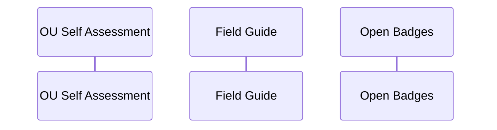

# Open-Umbrella
 

The Open Umbrella (OU) is intended to build up open educators resevoir of knowledge and consolidate their ICTE ccapacity
This resource intends to offer a scaffolded portfolio of tools and choices, (a self evaluation tool, field guide and a choice of open badges) 

# Components
1 The OU Self Evaluation App, with eight stating points or elememts that is made Adobe Storyline 

2 The OU Field Guide that corresponsds with the eight starting points 

3 The beginning of a set of OU Badges, that meed to correspond with the self evaluation app or the eight elelmemts. 

[cc-by]: http://creativecommons.org/licenses/by/4.0/
[cc-by-image]: https://i.creativecommons.org/l/by/4.0/88x31.png
[cc-by-shield]: https://img.shields.io/badge/License-CC%20BY%204.0-lightgrey.svg

# The Open Umbrella Community (OUC)

The open umbrella community (OUC) is an inclusive ICTE comminity that focusses on sharing and promoting open education practices and reseources.
Here, colleagues and students (departmental or disciplinary) can collaborate with each other. And be recognized for contributions to making course open
